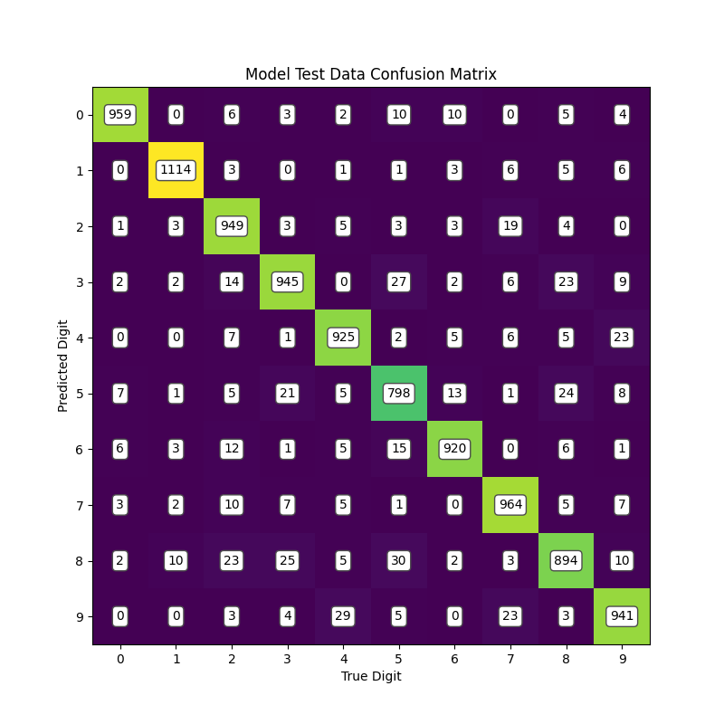

# MNIST Dataset - General Purpose ML Model

Machine learning model created using my [General Purpose ML Model package](https://github.com/sudthebud/ML-Model_General-Purpose), designed for the [MNIST Dataset](https://en.wikipedia.org/wiki/MNIST_database), a beginner machine learning dataset. Achieved an accuracy on testing data of ~**94%**.

## How to Use
1. Clone the repo
2. Install the necessary packages
    - _numpy_
    - _matplotlib_
    - _PIL_
4. Download the data and insert it in the ```data``` folder
    - The data should be a CSV in the format ```digit, pxl_1_1, pxl_1_2, ..., pxl_28_28```
    - Keep the training and testing data in separate CSV files labeled ```mnist_train.csv``` and ```mnist_test.csv```, respectively
3. Insert any custom made test images you want to classify in the ```prediction_inputs``` folder
4. Run the script ```ML-Model_MNIST.py```
    - Set the flag ```RETRAIN_MODEL``` to ```True``` if you would like to change model attributes and/or retrain the model **(this will overwrite the saved model ```mnist_model.sudml``` in the ```results``` folder)**
5. View any updated plots in the ```results``` folder

## Results
All metrics calculated (except for accuracy) are a sum of that metric calculated for each class, weighted based on how many instances of each class is in the dataset.
### Training

### Testing
**Metrics:**
- Accuracy: _94.09%_
- Recall: _94.09%_
- False Positive Rate: _00.65%_
- Precision: _94.11%_
- F1 Score: _94.09%_



## Credits
Dataset retrieved from [Georgia Tech DiSL](https://git-disl.github.io/GTDLBench/datasets/mnist_datasets/).