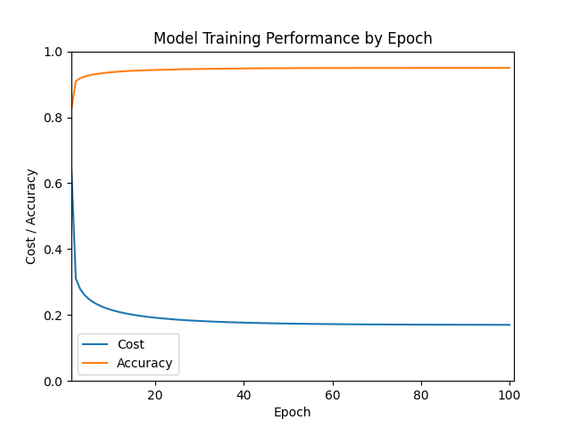

# MNIST Dataset - General Purpose ML Model

Machine learning model created using my [General Purpose ML Model package](https://github.com/sudthebud/ML-Model_General-Purpose), designed for the [MNIST Dataset](https://en.wikipedia.org/wiki/MNIST_database), a beginner machine learning dataset. Achieved an accuracy on testing data of ~**94%**.

## Results
### Training

### Testing
**Metrics:**
- Accuracy: _94.09%_
- Recall: _94.00%_
- False Positive Rate: _0.66%_
- Precision: _94.01%_
- F1 Score: _94.00%_

## Credits
Dataset retrieved from [Georgia Tech DiSL](https://git-disl.github.io/GTDLBench/datasets/mnist_datasets/).